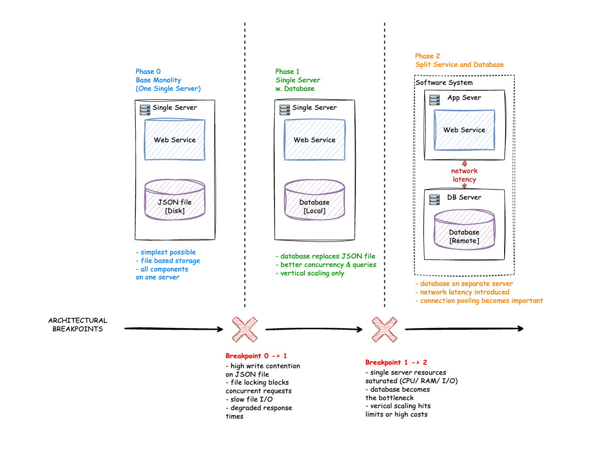

# PulseBoard - Leaderboard Service
> - **Document Status**: Draft
> - **Last Updated**: 2026 May 03
> - **Author**: Paul Serban

<!-- 
INSTRUCTIONS: Replace [Project Name] with your actual project name and provide a brief tagline.
This document serves as the comprehensive architecture documentation for the system.
-->

PulseBoard is a leaderboard website and API for multi-game competitive products.
The service combines two priorities:
1. High-quality player experience through fast per-game ranking pages.
2. Business visibility through platform metrics and operational pages.

## Overview

<!-- 
INSTRUCTIONS: Provide a high-level introduction to the project.
- What is the business/organization?
- What problem does this system solve?
- What is the current state and desired future state?
- Who are the primary stakeholders?
-->

**Brief description**: PulseBoard is a multi-game ranking platform built for gaming organizations that need transparent, auditable, and real-time competitive standings across more than one title.

**Business Context**
- Company size: Small startup with a lean team.
- Current state: Early development with a focus on core features and architecture.
- Desired future state: A fully functional, scalable leaderboard platform with a growing user base and robust business operations.
- Industry: Online Gaming
- Goal: Support growth from early adopters to high-volume player traffic.
- Target Personas:
	- Players who want clear ranking and profile visibility.
	- Business operators who need reliable engagement and performance data.

## Requirements

### Functional Requirements (What the system should do)

<!-- 
INSTRUCTIONS: List all functional requirements - the features and capabilities the system must provide.
Organize by domain/module if the system is complex.
Use clear, action-oriented language.
-->
   - The system must handle home and leaderboard pages.
   - The system must provide per-game and overall leaderboard views.
   - The system must provide API endpoints for fetching leaderboard, games, and user data in JSON format.
   - The system must provide API endpoints for creating, updating, and deleting user data.
   - The system must handle user profile pages with detailed information.
   - The system must show per-game score breakdowns for individual users.
   - The system must provide a not-found page for invalid user requests.
   - The system must handle business website pages.
   - The system must be containerized for easy deployment.

### Non-Functional Requirements (What the system should deal with)

<!-- 
INSTRUCTIONS: Document all non-functional requirements including performance, scalability, 
security, reliability, and integration needs. Provide specific numbers where possible.
-->

   - The system must be highly performant, with low latency for page rendering and API responses.
   - The system must be scalable to an increasing number of users.
   - The system must be reliable, with minimal downtime and robust error handling.
   - The system must be testable, with unit, integration, and end-to-end tests to ensure functionality and performance.
   - The system must be compatible with modern web browsers and devices.

**Performance Requirements:**
- TBD after initial implementation and testing.

**Data Volume Estimation:**
<!-- Provide detailed calculations for storage requirements 
- [Entity type]: ~[size] per record
- Average [X] items per [entity]
- Total storage per [entity]: ~[calculated size]
- Total storage for [scale]: ~[total calculated size]
- Data types: [e.g., "Mix of relational and unstructured data"]
- Growth rate: [e.g., "Low/Medium/High with X% annual growth"]
-->
- TBD after initial implementation and testing.

**Service Level Agreement (SLA):**
- TBD after initial implementation and testing.

**Integration Requirements:**
<!-- Document external systems and integration points -->
- The system must provide a RESTful API for integration with third-party services and internal tools.
- **Online Gaming**: The system must integrate with popular gaming platforms to fetch player data and scores.

**Infrastructure Constraints:**
- Local commercial hosting VPS with Node.js support.
- Containerization using Docker for deployment.

## Executive Summary
<!-- 
INSTRUCTIONS: Provide a concise summary of the entire architecture for executives and stakeholders.
This should be readable in 2-3 minutes and give a complete picture.
-->

PulseBoard is a multi-game leaderboard platform designed to provide transparent and real-time competitive standings for gaming organizations. The system follows a layered architecture with a clear separation of concerns between the presentation layer (SSR routes), domain layer (controllers), and data layer (JSON file storage).



**Architecture Style**: Layered architecture with a focus on modularity and separation of concerns.

**Key Components**:
1. **Web Layer**: Built with Express.js and Handlebars for server-side rendering. It handles all HTTP requests, rendering of HTML pages, and serving static assets.
2. **Domain Layer**: Contains controllers that orchestrate the business logic, including data retrieval and manipulation. It also handles input validation and ensures that the business rules are enforced.
3. **Data Layer**: Uses JSON file storage to persist game catalog, player data, scores, and announcements. It provides an in-memory cache for efficient read/write operations.
4. **API Layer**: Exposes RESTful endpoints for fetching leaderboard data, game information, and user management operations. It ensures that all API responses are consistent and follow the defined contracts.
5. **Business Website Pages**: Provides static content about the business, its services, and contact information, enhancing visibility and credibility.

**Technology Stack**:
- Node.js 24
- Express.js for web server and routing
- Handlebars for server-side rendering
- JSON file storage for data persistence
- Docker for containerization

**Architecture Principles**:
1. **Per-game accuracy over vanity aggregation**: Scores are always attributable to a specific title.
2. **Transparent ranking logic**: Higher score in a game = better rank in that game. No hidden weights.
3. **Full API parity**: Every page on this site has a JSON API equivalent for integrations.
4. **Operational simplicity**: Create, update, and delete player records without touching a database.
5. **Scalability and Performance**: The architecture is designed to handle increasing user traffic while maintaining low latency for page rendering and API responses.
6. **Reliability and Testability**: The system includes robust error handling and is designed to be testable with unit, integration, and end-to-end tests to ensure functionality and performance.
7. **Integration and Extensibility**: The architecture allows for easy integration with third-party services and internal tools, and is designed to be extensible for future features and enhancements.
8. **Containerization**: The system is designed to be containerized using Docker, facilitating easy deployment and scalability across different environments.
9.  **Data Consistency**: The architecture ensures that the leaderboard reflects accurate rankings based on per-game scores and overall totals, with proper handling of concurrent updates and reads.
10. **Observability**: The architecture includes mechanisms for monitoring and exposing key metrics, such as leaderboard freshness and API performance, to ensure operational visibility and facilitate troubleshooting.
11. **User Experience**: The architecture supports a seamless user experience with fast page loads, intuitive navigation, and responsive design for compatibility across devices.
12. **Business Visibility**: The architecture includes dedicated pages for business content, such as about, services, FAQ, and contact information, to enhance visibility and credibility with users.

**System Characteristics**
- High Read-to-Write Ratio: The leaderboard will be read frequently, but updates to user scores will be less frequent.
- Scalability: The system must handle a large number of concurrent users and requests without degradation in performance.
- Data Consistency: The leaderboard must reflect accurate rankings based on per-game scores and overall totals.

## Runtime Architecture
1. Web Layer (Express + Handlebars)
   - SSR routes render home, leaderboard, games, users, profile, and business pages.
   - API routes expose JSON payloads for leaderboard, games, and user lifecycle operations.
2. Domain Layer (Controllers)
   - Controllers orchestrate query and mutation flows.
   - Input validation is handled at controller/storage boundaries.
3. Data Layer (JSON file storage)
   - Game catalog, players, per-game scores, and announcements are persisted in `data/players.json`.
   - Read/write access uses Node `fs` APIs with in-memory cache initialization.
   - `data/site.json` stores markdown navigation and routable content metadata.

## Components

<!-- 
INSTRUCTIONS: List and describe all major components in the system.
For each component, explain its purpose, responsibilities, and boundaries.
-->

Based on [the requirements](#requirements), the following components comprise the system architecture:

1. **Web Layer (Express + Handlebars)**
   - SSR routes render home, leaderboard, games, users, profile, and business pages.
   - API routes expose JSON payloads for leaderboard, games, and user lifecycle operations.
   - Responsibilities: Handle HTTP requests, render HTML pages, serve static assets, and provide API endpoints.
   - Boundaries: Does not contain business logic or data access code; delegates to the domain layer.

2. **Domain Layer (Controllers)**
   - Controllers orchestrate query and mutation flows.
   - Input validation is handled at controller/storage boundaries.
   - Responsibilities: Implement business logic, validate inputs, and coordinate data retrieval and manipulation.
   - Boundaries: Does not directly handle HTTP requests or data storage; interacts with the web layer and data layer.

3. **Data Layer (JSON file storage)**
   - Game catalog, players, per-game scores, and announcements are persisted in `data/players.json`.
   - Read/write access uses Node `fs` APIs with in-memory cache initialization.
   - Responsibilities: Manage data persistence, provide an interface for reading and writing data, and ensure data consistency.
   - Boundaries: Does not contain business logic or handle HTTP requests; interacts with the domain layer.
   - Note: This component is designed for simplicity and may need to be replaced with a more robust database solution as the system scales.

4. **API Layer**
   - Exposes RESTful endpoints for fetching leaderboard data, game information, and user management operations.
   - Responsibilities: Ensure that all API responses are consistent and follow the defined contracts, handle input validation for API requests, and return appropriate status codes for success and errors.
   - Boundaries: Does not contain business logic or data storage code; interacts with the web layer and domain layer.

5. **Business Website Pages**
   - Provides static content about the business, its services, and contact information.
   - Responsibilities: Enhance visibility and credibility with users by sharing information about the business, its mission, team members, services offered, and contact details.
   - Boundaries: Does not contain business logic or data storage code; rendered using server-side templates and may include static content.

## Services Drill Down

<!-- 
INSTRUCTIONS: This is the most detailed section. For each service/component,
provide comprehensive technical specifications including architecture, API design,
and deployment strategy.
-->

This section provides detailed architecture and design specifications for each service component in the system.

### Web Service (Express + Handlebars)
**Purpose**: Serve web pages and API endpoints for the leaderboard application.
**Architecture Decision Process:**
1. **Applicartion Type**
- What it does: Handles HTTP requests, renders HTML pages, and serves JSON APIs.
- Type decription: Web Application
2. **Technology Stack**
- Node.js 24
- Express.js for web server and routing
- Handlebars for server-side rendering
3. **Architecture Design**
- Pattern: Layered architecture with separation of concerns between web layer, domain layer, and data layer.
- Layers/Components:
  - Web Layer: Handles HTTP requests, renders pages, and serves APIs.
  - Domain Layer: Contains business logic and controllers.
  - Data Layer: Manages data persistence using JSON file storage.
4. **API Design**
<!-- 
INSTRUCTIONS: For services exposing APIs, document all endpoints.
Follow REST conventions or your chosen API style (GraphQL, gRPC, etc.)
-->
## Endpoints
<!-- @TODO: Maintain parity between documented and implemented routes. Consider using Swagger/OpenAPI for interactive documentation and testing. -->
| Functionality     | HTTP Method | Endpoint           | Return Codes                           | Description                                               |
| ----------------- | ----------- | ------------------ | -------------------------------------- | --------------------------------------------------------- |
| Home Page         | GET         | `/`                | 200 OK                                 | Renders home content and top overall players.             |
| Home Alias        | GET         | `/home`            | 200 OK                                 | Renders the same content as `/`.                          |
| Leaderboard Page  | GET         | `/leaderboard`     | 200 OK                                 | Renders overall leaderboard or game-filtered leaderboard. |
| Games Page        | GET         | `/games`           | 200 OK                                 | Renders game catalog and game navigation links.           |
| Users Page        | GET         | `/users`           | 200 OK                                 | Renders the users page with the list of users.            |
| User Profile Page | GET         | `/users/:id`       | 200 OK, 404 Not Found                  | Renders the user profile with per-game scores.            |
| Get Leaderboard   | GET         | `/api/leaderboard` | 200 OK, 400 Bad Request                | Fetches overall or per-game leaderboard JSON payload.     |
| Get Games         | GET         | `/api/games`       | 200 OK                                 | Fetches game catalog in JSON format.                      |
| Get Users         | GET         | `/api/users`       | 200 OK                                 | Fetches the list of users in JSON format.                 |
| Get User by ID    | GET         | `/api/users/:id`   | 200 OK, 400 Bad Request, 404 Not Found | Fetches user data for a specific user in JSON format.     |
| Create User       | POST        | `/api/user`        | 201 Created, 400 Bad Request           | Creates a new user with the provided data.                |
| Update User       | PUT         | `/api/user/:id`    | 200 OK, 400 Bad Request, 404 Not Found | Updates user fields and/or per-game scores for a user.    |
| Delete User       | DELETE      | `/api/user/:id`    | 200 OK, 400 Bad Request, 404 Not Found | Deletes a specific user from the database.                |

## Business Website Routes

| Functionality | HTTP Method | Endpoint   | Return Codes | Description                                 |
| ------------- | ----------- | ---------- | ------------ | ------------------------------------------- |
| About         | GET         | `/about`   | 200 OK       | Renders about content plus platform stats.  |
| Services      | GET         | `/service` | 200 OK       | Renders services and integration guidance.  |
| FAQ           | GET         | `/faq`     | 200 OK       | Renders frequently asked questions.         |
| Contact       | GET         | `/contact` | 200 OK       | Renders support and communication channels. |

## Request and Response Notes

1. `GET /api/leaderboard`
	- Optional query parameters:
	  - `limit` (positive integer).
	  - `game` (game ID such as `apex-arena`, `turbo-drift`, `dark-siege`, `neon-blitz`).
	- `400 Bad Request` if `limit` is invalid.
	- `400 Bad Request` if `game` does not exist.
2. `GET /api/games`
	- Returns all games with IDs, names, genres, and descriptions.
3. `GET /api/users`
	- Optional query parameters:
	  - `q`: text search across player fields.
	  - `sort`: `id`, `name`, or `score`.
4. `GET /api/users/:id`
	- Returns `400 Bad Request` when `id` is not a positive integer.
5. `POST /api/user`
	- Requires `firstName` and `lastName`.
	- Optional fields: `scores`, `address`, `email`, `phone`, `website`, `company`, `country`, `team`.
6. `PUT /api/user/:id`
	- Accepts partial payload updates.
	- `scores` accepts partial objects and merges into existing per-game scores.
	- Returns `400 Bad Request` for empty or invalid update payloads.

## Data Shape (User)

```json
{
  "id": 11,
  "firstName": "Ava",
  "lastName": "Morgan",
  "address": "123 Example Street",
  "email": "ava@example.com",
  "phone": "123-456-7890",
  "website": "ava.gg",
  "company": "Guild Ventures",
  "country": "Romania",
  "team": "Skyline Division",
  "scores": {
    "apex-arena": 410,
    "turbo-drift": 870,
    "dark-siege": 650,
    "neon-blitz": 920
  }
}
```

**API Usage Examples**
<!--  @TODO: setup SwaggerUI for interactive API documentation and testing, or provide curl/Postman examples for key endpoints instead of static request/response pairs below. -->
1. Fetch overall leaderboard
Request:
```json
```
Response:
```json
```
2. Fetch per-game leaderboard
3. Fetch user profile
4. Create a new user
5. Update user scores
6. Delete a user
7. Fetch game catalog
8. Fetch business page content

**Response Codes Explained**
- `200 OK`: The request was successful, and the server returned the requested data or rendered the requested page.
- `201 Created`: The request was successful, and a new resource was created as a result.
- `400 Bad Request`: The server could not understand the request due to invalid syntax or missing required parameters.
- `404 Not Found`: The requested resource could not be found on the server.
- `500 Internal Server Error`: The server encountered an unexpected condition that prevented it from fulfilling the request.
- `503 Service Unavailable`: The server is currently unable to handle the request due to temporary overload or maintenance.
- `504 Gateway Timeout`: The server did not receive a timely response from an upstream server while acting as a gateway or proxy.
- `401 Unauthorized`: The request requires user authentication, and the client has not provided valid credentials.
- `403 Forbidden`: The server understood the request but refuses to authorize it, typically due to insufficient permissions.
- `422 Unprocessable Entity`: The server understands the content type of the request entity, but was unable to process the contained instructions, often due to semantic errors in the request data.
- `429 Too Many Requests`: The user has sent too many requests in a given amount of time ("rate limiting").
- `304 Not Modified`: The requested resource has not been modified since the last request, allowing the client to use cached data.
- `204 No Content`: The server successfully processed the request, but is not returning any content, often used for successful DELETE requests.
- `202 Accepted`: The request has been accepted for processing, but the processing has not been completed, often used for asynchronous operations.
- `409 Conflict`: The request could not be completed due to a conflict with the current state of the resource, often used when trying to create a resource that already exists or when there are conflicting updates.

5. **Business Rules**
1. Scores are always attributable to a specific title. There is no vanity aggregation.
2. Higher score in a game = better rank in that game. No hidden weights or multipliers.
3. Every page on this site has a JSON API equivalent for integrations.
4. Create, update, and delete player records without touching a database.
5. The leaderboard must reflect accurate rankings based on per-game scores and overall totals, with proper handling of concurrent updates and reads.
6. The architecture includes mechanisms for monitoring and exposing key metrics, such as leaderboard freshness and API performance, to ensure operational visibility and facilitate troubleshooting.
7. The architecture supports a seamless user experience with fast page loads, intuitive navigation, and responsive design for compatibility across devices.
8. The architecture includes dedicated pages for business content, such as about, services, FAQ, and contact information, to enhance visibility and credibility with users.

6. **Redundancy & Scalability**
<!-- @TODO: TBD after initial implementation and testing. -->
**Redundancy**: TBD after initial implementation and testing.
**Scalability**: TBD after initial implementation and testing.

7. **Error Handling**
<!-- @TODO: TBD after initial implementation and testing. -->

8. **Security**
<!-- @TODO: TBD after initial implementation and testing. -->

9. **Testing Strategy**
- Unit tests for individual functions and modules.
- Integration tests for API endpoints and data layer interactions.
- End-to-end tests for user flows and overall system functionality.
- Performance tests to ensure the system meets response time requirements.

10. **Deployment Strategy**
- The system will be containerized using Docker for easy deployment across different environments.
- Deployment will be done on a local commercial hosting VPS with Node.js support.
- Continuous Integration/Continuous Deployment (CI/CD) pipelines will be set up to automate testing and deployment processes.
- Monitoring and logging will be implemented to track system performance and identify issues in production.
- The deployment strategy will also include regular backups of the JSON data files to prevent data loss and ensure recoverability in case of failures.

## Architecture Diagrams

<!-- 
INSTRUCTIONS: Include all relevant diagrams with descriptions.
Recommended diagram types:
- Context Diagram (system boundary and external actors)
- Component Diagram (logical components)
- Deployment Diagram (physical infrastructure)
- Sequence Diagrams (key workflows)
- Data Flow Diagrams
-->

### Context Diagram
<!-- @TODO: Create a context diagram showing the system boundary and external actors/systems. -->
**Purpose**: Shows the system boundary and external actors/systems.

[Description of what this diagram shows]

### Component Diagram (Logic View)
<!-- @TODO: Create a component diagram showing the high-level components and their logical relationships. -->

**Purpose**: Illustrates the high-level components and their logical relationships.

[Description of what this diagram shows]

### Deployment Diagram (Physical View)
<!-- @TODO: Create a deployment diagram showing the deployment topology and infrastructure layout. -->
**Purpose**: Shows the deployment topology and infrastructure layout.

[Description of what this diagram shows]

### Technical Diagram
<!-- @TODO: Create a technical diagram showing the technology stack and communication protocols. -->
**Purpose**: Details the technology stack and communication protocols.

[Description of what this diagram shows]

### Sequence Diagrams
<!-- @TODO: Create sequence diagrams for key workflows - use mermaid syntax -->
#### [Key Workflow 1]
```mermaid
```

**Steps:**
1. [Step 1 description]
2. [Step 2 description]
3. [Step 3 description]

## Data Architecture

<!-- 
INSTRUCTIONS: Document database schema, data models, and data flow.
Include entity relationships and data lifecycle.
-->

### Data Model

**Key Entities:**
- **[Entity 1]**: [Description and key attributes]
- **[Entity 2]**: [Description and key attributes]
- **[Entity 3]**: [Description and key attributes]

**Entity Relationships:**
- [Entity 1] [relationship type] [Entity 2]: [Description]
- [Entity 2] [relationship type] [Entity 3]: [Description]

### Data Lifecycle

**Create:**
- [When and how data is created]

**Read:**
- [How data is accessed]
- [Query patterns]

**Update:**
- [Update patterns and frequency]

**Delete:**
- [Deletion strategy: hard delete, soft delete, archival]

## Monitoring and Observability

<!-- 
INSTRUCTIONS: Document monitoring strategy, metrics, alerts, and dashboards.
-->

### Monitoring Strategy

**Layers of Monitoring:**
1. **Infrastructure Monitoring**: [What is monitored at infrastructure level]
2. **Application Monitoring**: [What is monitored at application level]
3. **Business Monitoring**: [What business metrics are tracked]

### Key Metrics

**System Health Metrics:**
- **Availability**: [e.g., "Service uptime percentage"]
- **Response Time**: [e.g., "Average, P50, P95, P99 latency"]
- **Error Rate**: [e.g., "Percentage of failed requests"]
- **Throughput**: [e.g., "Requests per second"]

**Infrastructure Metrics:**
- **CPU Usage**: [Threshold for alerts]
- **Memory Usage**: [Threshold for alerts]
- **Disk I/O**: [Threshold for alerts]
- **Network Bandwidth**: [Threshold for alerts]

**Application Metrics:**
- **[Service 1]**: [Specific metrics]
- **[Service 2]**: [Specific metrics]
- **Database**: [Query performance, connection pool, lock waits]
- **Message Queue**: [Queue depth, processing lag, dead letters]

**Business Metrics:**
- [Business KPI 1]: [What it measures]
- [Business KPI 2]: [What it measures]
- [Business KPI 3]: [What it measures]

### Logging

**Log Levels:**
- **ERROR**: [When to use - application errors requiring attention]
- **WARN**: [When to use - potential issues or unusual conditions]
- **INFO**: [When to use - significant application events]
- **DEBUG**: [When to use - detailed troubleshooting (non-production)]

**Log Structure:**
```json
{
  "timestamp": "ISO-8601 format",
  "level": "ERROR|WARN|INFO|DEBUG",
  "service": "service-name",
  "traceId": "correlation-id",
  "userId": "user-identifier",
  "message": "log message",
  "details": { "additional": "context" }
}
```

**Log Storage:**
- Centralized logging: [Technology, e.g., "ELK, Splunk, CloudWatch"]
- Retention: [e.g., "30 days in hot storage, 1 year in cold storage"]
- Access: [Who can access logs]

### Dashboards

**Operations Dashboard:**
- Overall system health
- Service status indicators
- Current error rates
- Active alerts

**Performance Dashboard:**
- Response time trends
- Throughput graphs
- Resource utilization
- Database performance

**Business Dashboard:**
- [Business metric 1] trends
- [Business metric 2] trends
- User activity metrics
- Feature usage statistics

### Distributed Tracing

**Tracing Strategy:**
- Tool: [e.g., "Jaeger, Zipkin, AWS X-Ray"]
- Trace Context: [How correlation IDs are propagated]
- Sampling: [e.g., "Sample 10% of requests, 100% of errors"]

**Use Cases:**
- Debug slow requests
- Identify bottlenecks
- Understand service dependencies
- Root cause analysis

## Performance Optimization

<!-- 
INSTRUCTIONS: Document performance optimization strategies.
-->

### Caching Strategy
**Cache Layers:**
- **Browser Cache**: [What is cached, TTL]
**Cache Invalidation:**
- **Strategy**: [e.g., "Time-based / Event-based"]

## Testing Strategy

<!-- 
INSTRUCTIONS: Document testing approach across all levels.
-->

**Unit Tests:**
- Coverage Target: [e.g., "80% code coverage"]
- Tools: [Testing frameworks]
- Execution: [When tests run]

**Integration Tests:**
- Scope: [What is tested]
- Tools: [Testing frameworks]
- Execution: [When tests run]

**End-to-End Tests:**
- Scenarios: [Key user journeys]
- Tools: [e.g., "Selenium, Cypress, Playwright"]
- Execution: [When tests run]

**Performance Tests:**
- Load Testing: [Scenarios and tools]
- Stress Testing: [Breaking point tests]
- Endurance Testing: [Long-duration tests]

